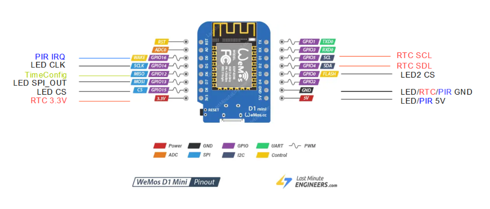
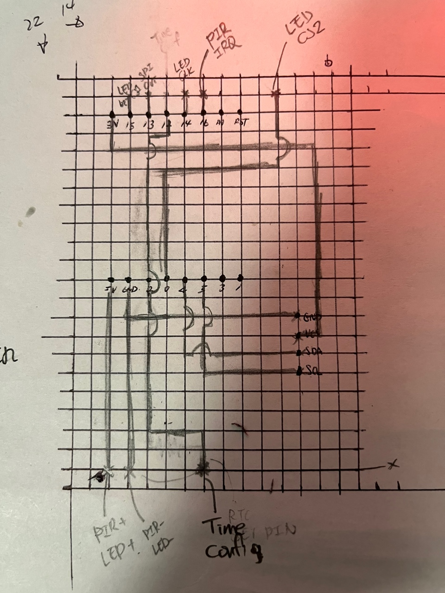
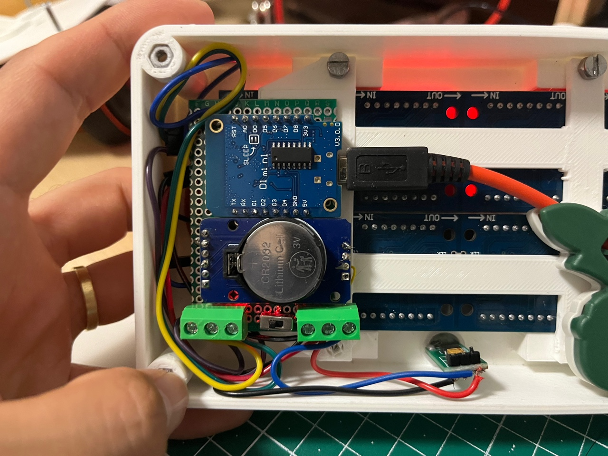
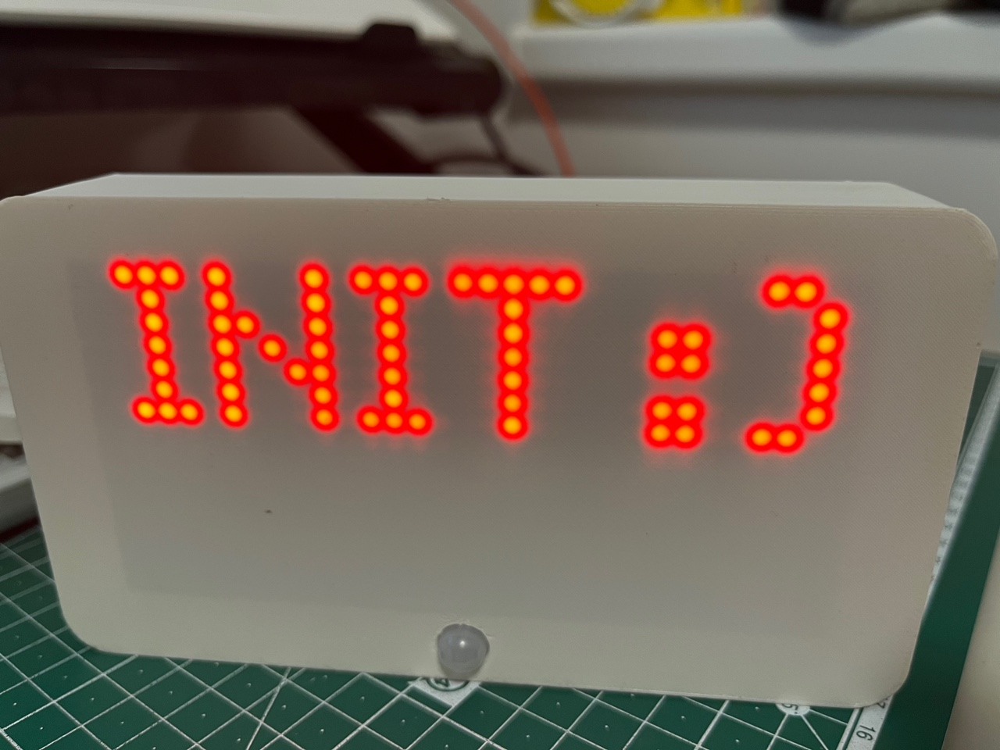
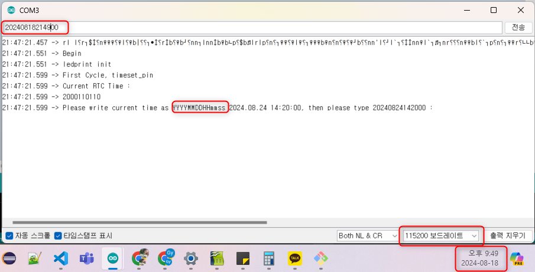

# DPlusCounter
## 1. Objective
This is a LED clock with D+ counter. In the normal consequence, it shows month, day, hour minutes with blinking with 1 second interval. When there is a movement detected, then it shows how many days passed from the reference day.

## 2. Components
### 1. HW
#### 1. List 
- 3D printed case
- Wemos D1 m1 : Main micro controller
- DS3231 module : RTC(Real Time Clock) module
- SR505 - PIR sensor : Motion sensor module
- MAX7219-4DM : 4 Red LED display 
- Mini Switch : boot with time set mode or normal mode

#### 2. Connections
- Wemos D1 M1 connection 
- PCB Wiring 
### 2. SW
- It is very straight forward.
- There is main state machine \
  State1 : Run first cycle only. Check if time set mode or not\
  State2 : Regular clock display mode. Month / Day / Hour / Minute\
  State3 : D+ counter view
- It contains following libraries \
  MD_MAX72XX : https://github.com/MajicDesigns/MD_MAX72XX 
  RTC_LIB : https://github.com/adafruit/RTClib 

## 3. How-to
### 1. How to set the internal real time clock
#### Precondition : You need to have ARDUINO IDE or something that you can do UART communication with Wemos D1 m1
- Open the box and disconnect usb cable connectinb the cover usb slot and wemos
- Set the switch head to the left for time set mode 
- Connect the usb and open serial monitor and set baudrate as '115200'
- Maybe reset the target hw by pressing reset button on the upper side of the micro controller 
- Type the current time in YYYYMMDDHHmmss form. (Just pure number) 

### 2. How to set the reference time
- Why would you change the reference time? :o
- You can change the reference day by modifying this global variable in the code. The type is YYYY, Month, Day, Hour, Minute, Second "DateTime referenceDay(2024, 8, 5, 00, 00, 00);"